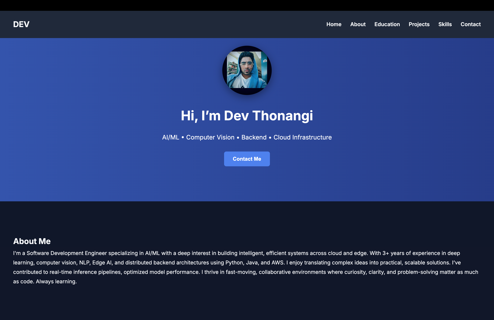

# 🌐 Personal Portfolio - Devi Vara Prasad Thonangi

Welcome to my developer portfolio! This site highlights my work as a Software Development Engineer with experience in AI, Backend, and Embedded Systems. Built using clean HTML with embedded CSS and JavaScript, it's deployed live via Netlify.

---

## 🚀 Live Site

👉 [https://devtportfolio.netlify.app](https://devtportfolio.netlify.app)

---

## 🧰 Tech Stack

- **HTML5**
- **Inline CSS (in `<style>` tag)**
- **Vanilla JavaScript (in `<script>` tag)**
- **Netlify (Hosting & Forms)**
- **Responsive Layout**
- **Font Awesome Icons**

---

## 📌 Features

- ✅ Responsive landing page
- ✅ Gradient-animated hero section with profile picture
- ✅ Contact form powered by Netlify Forms
- ✅ Custom thank-you confirmation page
- ✅ Projects section with direct GitHub links
- ✅ Categorized and icon-enhanced skills section
- ✅ Scroll to top button + fade-in animations

---

## 📷 Screenshot




---

## 📬 Contact

Feel free to connect with me:

- 💼 [LinkedIn](https://www.linkedin.com/in/thonangidev/)
- 💻 [GitHub](https://github.com/devthonangi)
- 📫 Contact form is live on the site!

---

## 🛠 How to Run Locally

```bash
git clone https://github.com/devthonangi/portfolio.git
cd portfolio
# then open index.html in your browser
